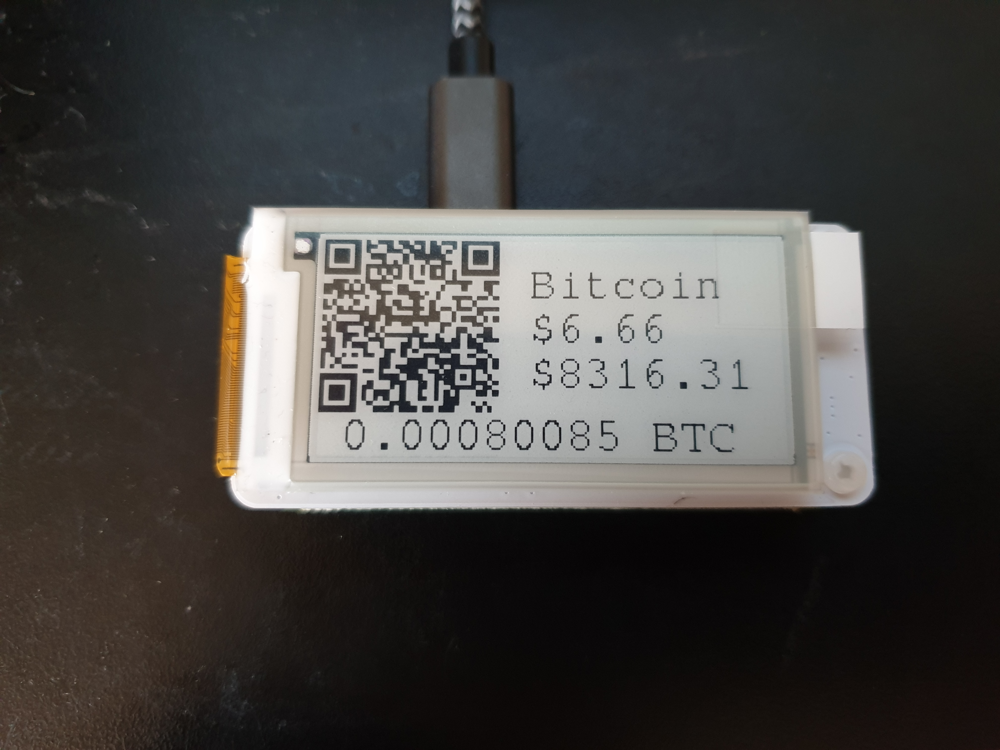

# How to Build a Bitcoin/Crypto Piggy Bank with a Raspberry Pi + PaPiRus display.

Inspired by [Satoshi Piggy Bank](https://github.com/kiltonred/satoshi-piggy-bank/)

I decided to make a similar thing using the [PaPiRus](https://uk.pi-supply.com/products/papirus-epaper-eink-screen-hat-for-raspberry-pi) screen.  Also using an xpub so the address on the screen changed every time it is funded.  Because of the eink screen the image can persist when the PI is powered down.

---

Instructions write-up TODO
