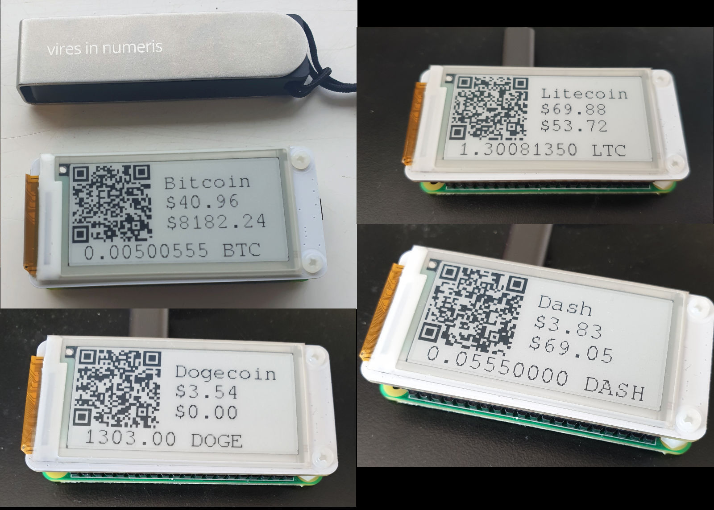

# How to Build a Bitcoin/Crypto Piggy Bank with a Raspberry Pi + PaPiRus display.

Inspired by [Satoshi Piggy Bank](https://github.com/kiltonred/satoshi-piggy-bank/)

I decided to make a similar thing using the [PaPiRus](https://uk.pi-supply.com/products/papirus-epaper-eink-screen-hat-for-raspberry-pi) screen.  Also using an xpub so the address on the screen changed every time it is funded.  Because of the eink screen the image can persist when the PI is powered down.

Current support Bitcoin, Litecoin, Dogecoin & Dash.




---

## Parts list

#### [Raspberry Pi Zero WH](https://shop.pimoroni.com/products/raspberry-pi-zero-wh-with-pre-soldered-header) (£13)

I chose pre-soldered because of laziness.

#### [PaPiRus e-ink screen](https://thepihut.com/products/papirus-zero-epaper-eink-screen-phat-for-pi-zero) (£26)

This screen covers the RPI Zero nicely.  2" and 200x96 px.

#### [MicroSD 16GB](https://thepihut.com/products/16gb-micro-sd-integral-class-10-blank) (£6)

I used a 16gb class 10 but anything 4gb or larger should work.


## Raspberry Pi Zero W Setup

Download Raspbian Lite from [raspberrypi.org](https://www.raspberrypi.org/downloads/raspbian/).  And write the image to a microsd card, detailed instructions [here](https://www.raspberrypi.org/documentation/installation/installing-images/README.md).

Once flashed mount the first partition and touch a file called 'ssh'.  This will enable ssh on boot.
```shell
mkdir t
sudo mount /dev/sdX1 t
sudo touch t/ssh
sudo umount t
```

Mount the second partition and edit the wpa_supplicant.conf to add your wifi credentials.
```
sudo mount /dev/sdX2 t
sudo vim t/etc/wpa_supplicant/wpa_supplicant.conf
# Add this chunk
# network={
#   scan_ssid=1
#   ssid="MyNetworkSSID"
#   psk="password"
# }
sudo umount t
```

Now boot the RPI and connect via SSH.  Run `raspi-config` to update and expand filesystem etc as you prefer.

## Setup satoshi-piggy-bank

Install updates and required packages.
```shell
sudo apt update
sudo apt upgrade
sudo apt install python3-venv python3-pip git vim htop
```

Install the PaPiRus driver.  See [PaPiRus github](https://github.com/PiSupply/PaPiRus).
```shell
# Run this line and PaPiRus will be setup and installed
# Choose python3
curl -sSL https://pisupp.ly/papiruscode | sudo bash

# Run the test
papirus-test
```

Clone the satoshi-piggy-bank repo.
```shell
git clone https://github.com/timchurchard/satoshi-piggy-bank.git
```

Install the python3 dependencies
```
sudo pip3 install -U pip setuptools
sudo pip3 install -r satoshi-piggy-bank/requirements.txt
```

Test run the satoshi-piggy-bank
```
python3 satoshi-piggy-bank/code/piggy-bank.py
```

Edit the /etc/rc.local file to run the scripts on boot.
`sudo vim /etc/rc.local`
```shell
#!/bin/sh -e
#
# rc.local
#
# This script is executed at the end of each multiuser runlevel.
# Make sure that the script will "exit 0" on success or any other
# value on error.
#
# In order to enable or disable this script just change the execution
# bits.
#
# By default this script does nothing.

# Wait for network
bash /home/pi/satoshi-piggy-bank/code/wait-for-network.sh

# Print the IP address
_IP=$(hostname -I) || true
if [ "$_IP" ]; then
  printf "My IP address is %s\n" "$_IP"
fi

# Run the satoshi-piggy-bank as pi user
export PYTHONPATH=/home/pi/satoshi-piggy-bank/code
su pi -c "python3 -m piggy-bank.py"
# Add your own --xpub xpubXXYY...
```
